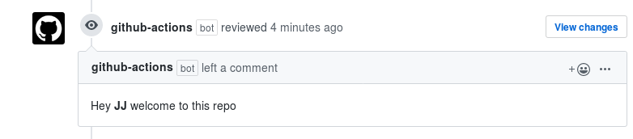

# Greeting for first pull request

Greets pull requests, using metadata such as user name. Forked from [`actions/first interaction`](https://github.com/actions/first-interaction)

# Usage

See [action.yml](action.yml)

```yaml
steps:
- uses: actions/first-interaction@v1
  with:
    repo-token: ${{ secrets.GITHUB_TOKEN }}
    pr-message: 'Greetings, **#**, and thanks for your first contribution'
```

This action will check if it's the first pull request to the repo and
greet them; if you use the hash sign inside the message, it will get
substituted by the login name of the person doing the PR.




# License

The scripts and documentation in this project are released under the [MIT License](LICENSE)
